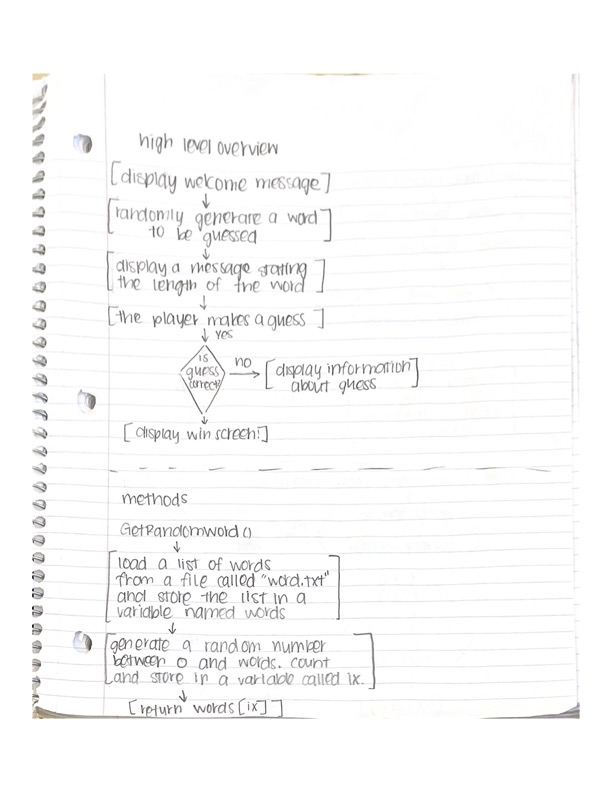
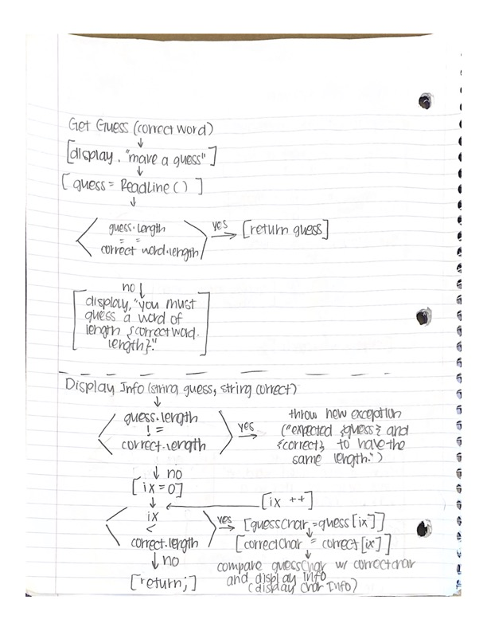

# personalproject2

## Description

Wordle is a guessing game in which the player attempts to guess a secret word. Initially, they only know the length of the word. When they make a guess, they are told which letters they guessed are in the word, which letters are not in the word, and which letters are in the word and in the correct location.

## Overview

The purpose of Wordle is to provide entertainment to the player. Wordle accepts guesses from the uses using keyboard inputs. The result of each guess is then written to the console.

## High Level Design

At a high level the game works in the following way:
1. Displays a Welcome Message
2. A random word is then generated
3. The player is asked to make a guess
4. If the guess is correct, the player wins
5. If the guess is incorrect:
6. The player receives information based on their guess
7. The game continues to step 3

# Flow Charts

## Methods and Classes

void GetRandomWord()
string GetGuess(string correctWord)
void DisplayInfo(string guess, string correct)
void DisplayCharInfo(char guess, int pos, string correct)
